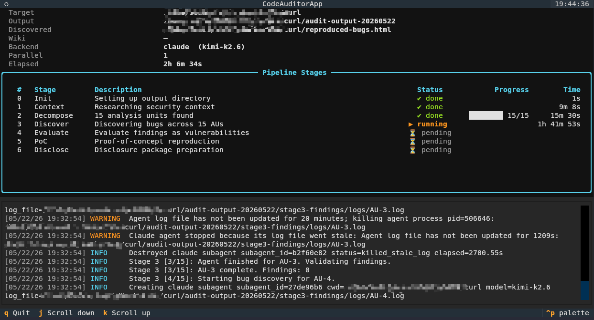

<p align="center">
  <a href="README.md">English</a> | <b>🇨🇳 中文</b>
</p>

# CodeAuditor

一个多阶段、智能化的代码审计流水线，支持在 [Claude Agent SDK](https://github.com/anthropics/claude-agent-sdk-python) 或 [Codex App Server Python SDK](https://github.com/openai/codex/blob/main/sdk/python/README.md) 上运行。给定一个目标源码树，CodeAuditor 会研究项目背景、将代码库分解为分析单元、寻找漏洞、将其评估为安全漏洞、用可工作的 PoC 复现，并最终准备一份可供披露的完整报告包。

CodeAuditor 已在多个广泛使用的开源项目中发现了 CVE — 详见下方的 [已发现漏洞](#已发现漏洞)。



## 工作原理

审计以七个顺序阶段运行。每个阶段由 `prompts/` 中的提示模板驱动，并由一个或多个后端智能体执行。输出会经过验证，验证失败时会发送修复提示（最多 `max_retries` 次）。中间产物会写入输出目录；`.markers/` 文件夹会跟踪已完成的子任务，以便运行可以恢复。

| 阶段 | 工作内容 | 并行度 |
|------|---------|--------|
| 0 | Git 拉取 + 创建输出目录 | 无 |
| 1 | 安全背景研究（git 历史、网络搜索、`SECURITY.md`） | 单个智能体 |
| 2 | 将项目分解为分析单元（AU） | 单个智能体 |
| 3 | 每个分析单元的漏洞发现 | 每 AU 1 个智能体 |
| 4 | 评估发现：真实漏洞？严重程度？ | 每发现 1 个智能体 |
| 5 | PoC 复现：构建、利用、捕获证据 | 每漏洞 1 个智能体 |
| 6 | 披露：技术报告、邮件、最小 PoC、压缩包 | 每漏洞 1 个智能体 |

阶段 1 会产生两个指令 —— *审计重点* 和 *漏洞判定标准* —— 这些指令会被注入到后续阶段，确保整个流水线与项目实际威胁模型保持一致。

### 系统设计

```
┌─────────────┐
│ Target Repo │
└──────┬──────┘
       │
       ▼
┌─────────────┐     ┌─────────────────────────────┐
│  Stage 0    │     │      DIRECTIVE INJECTION    │
│    Init     │────►│  ┌─────────┐  ┌─────────┐   │
└─────────────┘     │  │Auditing │  │Vuln     │   │
       │            │  │ Focus   │  │Criteria │   │
       ▼            │  └────┬────┘  └────┬────┘   │
┌─────────────┐     │       │            │        │
│  Stage 1    │────►│       └──────┬─────┘        │
│   Context   │     └──────────────┼──────────────┘
└─────────────┘                    │
       │                           │
       ▼                           ▼
┌─────────────┐   ┌─────────────┐   ┌─────────────┐   ┌─────────────┐   ┌─────────────┐
│  Stage 2    │──►│  Stage 3    │──►│  Stage 4    │──►│  Stage 5    │──►│  Stage 6    │
│  Decompose  │   │   Discover  │   │   Evaluate  │   │     PoC     │   │   Disclose  │
└─────────────┘   └─────────────┘   └─────────────┘   └─────────────┘   └──────┬──────┘
                                                                               │
                                                                               ▼
                                                                        ┌─────────────┐
                                                                        │  Disclosure │
                                                                        │   Package   │
                                                                        └─────────────┘
```

## 环境要求

- Python **3.12+**
- 已安装的 [Claude Code](https://docs.claude.com/en/docs/claude-code)（用于 `--backend claude`，SDK 会复用其认证）
- 位于 `/usr/local/bin/codex` 的 Codex CLI，支持 `codex app-server` 和本地 Codex 认证/会话（用于 `--backend codex`）
- Git 和可用的 Docker Engine；阶段 5/6 所需构建工具放在沙箱镜像中

## 安装

```bash
git clone https://github.com/COCOP1l0t/CodeAuditor.git
cd CodeAuditor
pip install -e .
```

这会暴露 `code-auditor` CLI 入口点。

## 用法

```bash
code-auditor --target /path/to/project [options]
```

### 常用选项

| 标志 | 说明 |
|------|------|
| **`--target`** | **必需**（除非使用 `--web` 或 `--repo-url`）。要审计的项目根目录。 |
| `--repo-url` | Git 仓库 URL。首次使用时克隆到 `~/.code_auditor/repo/{host}/{owner}/{repo}`，之后复用该检出（阶段 0 会用 `git pull` 保持更新）；克隆目录即为审计目标。 |
| `--output-dir` | 输出目录（默认：`~/.code_auditor/results/{repo}/audit-output-{commit}` —— 同一 repo+commit 始终复用同一目录，同一 commit 的多次审计自然合并续跑；非 git 目标回退为日期戳）。 |
| `--wiki` | 只读 LLM wiki 知识库目录。CodeAuditor 将其视为只读，并为智能体提供阶段特定的 wiki 搜索指导。 |
| `--max-parallel` | 最大并发智能体数（默认：`1`）。 |
| `--backend` | 智能体后端：`claude` 或 `codex`（默认：`claude`）。 |
| `--model` | 后端模型覆盖。Claude 默认为 `claude-sonnet-4-6`；Codex 使用本地 Codex 配置默认值，除非另行指定。 |
| `--target-au-count` | 阶段 2 的目标分析单元数量（默认：`-1` = 不设上限，尽可能探索所有值得深入分析的单元）。 |
| `--log-level` | `DEBUG` \| `INFO` \| `WARNING` \| `ERROR`（默认：`INFO`）。 |
| `--tui` | 启动交互式 TUI 仪表盘，替代纯日志输出。 |
| `--web` | 启动 Web 界面，审计参数在浏览器中填写（见下文）。 |
| `--host` | Web 界面绑定地址（默认：`127.0.0.1`；使用 `0.0.0.0` 可暴露到网络）。 |
| `--port` | Web 界面绑定端口（默认：`8000`）。 |
| `--db` | 审计历史 SQLite 数据库路径（默认：`~/.code_auditor/audits.db`）。 |
| `--sandbox-image` | 阶段 5/6 使用的 Docker 镜像（默认：`code-auditor-sandbox:latest`）。 |
| `--sandbox-root` | `/tmp` 下专用的临时根目录（默认：`/tmp/code-auditor`）。 |
| `--no-docker-sandbox` | 仅在受控调试时禁用 Docker 隔离；这会恢复持久化构建行为，正常审计不安全。 |
| `--retention-migration-dry-run [ROOT]` | 以 JSON 输出只读的历史 retain-manifest 迁移计划；默认扫描 `~/.code_auditor/results`。 |
| `--retention-manifest-apply [ROOT]` | 原子创建或修复经最新迁移计划验证通过的 manifest；绝不删除产物。 |
| `--retention-entrypoint-repair-dry-run [ROOT]` | 输出可安全自动修复的规范入口及精确人工 blocker 队列；绝不写文件。 |
| `--retention-entrypoint-repair-apply [ROOT]` | 仅创建无歧义的 `reproduce.sh` 包装入口及其有效 manifest；不运行 PoC、不删除产物。 |
| `--reviewed-cleanup-dry-run [ROOT]` | 仅为 SQLite 审核状态非 `unreviewed` 的已复现漏洞规划编译/缓存清理。 |
| `--reviewed-cleanup-apply [ROOT]` | 重新检查数据库，仅删除 reviewed cleanup 计划接受的编译/缓存目录。 |

**粗体** 选项为必需。

### 阶段 5/6 临时构建与保留产物

审计进入阶段 5 前，先构建一次默认沙箱镜像：

```bash
docker build -f docker/code-auditor-sandbox.Dockerfile \
  -t code-auditor-sandbox:latest docker
```

之后，每个阶段 5/6 任务都会在 `/tmp/code-auditor/` 下获得全新的源码检出与
可写工作区。Agent CLI 及其启动的所有构建、复现命令均在 Docker 中运行，使用
只读根文件系统、丢弃全部 capabilities、启用 `no-new-privileges`，并限制 CPU、
内存和 PID。被审计仓库的 Git 对象库仅以只读方式挂载；唯一可写的主机 bind
mount 是该任务自己的 `/tmp` scratch。任务结束后会删除 scratch 和带标签的容器。

清理前，CodeAuditor 会校验 `retain-manifest.json`，并原子导出其中声明的、大小
受限的普通文件。`reproduce.sh` 为必需的可执行 UTF-8 入口，不能引用临时
worktree、构建目录、toolchain 或 CodeAuditor 绝对路径。项目需要额外 SDK 时，
可以扩展自定义沙箱镜像，无需放宽运行时边界。

历史结果不会被自动修改。可用以下命令生成确定性的 dry-run 计划：

```bash
code-auditor --retention-migration-dry-run \
  ~/.code_auditor/results --db ~/.code_auditor/audits.db > retention-plan.json
```

报告包含建议的 manifest、逐产物 blocker、精确的临时路径、已分配空间估算，且
固定带有 `mutations: []`。正在运行的输出，以及无法通过数据库确认状态的输出，
都会标记为 blocked；`_merged-leftovers` 始终要求人工复核。检查计划后，可仅写入
已通过验证的 manifest：

```bash
code-auditor --retention-manifest-apply \
  ~/.code_auditor/results --db ~/.code_auditor/audits.db > manifest-apply.json
```

该命令会在每次原子写入前重新检查产物，可重复执行，仍不会删除或压缩任何历史
产物。

缺少规范入口时，可按两阶段修复：

```bash
code-auditor --retention-entrypoint-repair-dry-run \
  ~/.code_auditor/results --db ~/.code_auditor/audits.db > entrypoint-plan.json
code-auditor --retention-entrypoint-repair-apply \
  ~/.code_auditor/results --db ~/.code_auditor/audits.db > entrypoint-apply.json
```

自动修复仅接受一个带 shebang、可执行、普通且没有其他迁移 blocker 的旧脚本；
或者接受 `report.md` 以 `./相对路径` 明确调用且名称表明用于复现的唯一脚本。
生成的包装入口只负责委托并透传参数，不代表本次重新执行过 PoC。
`blocked_artifacts` 会保留工作树引用、报告缺失、披露包不完整、入口歧义及无效
manifest 的精确文件/marker 证据和建议修复动作。

历史编译结果使用独立的审核状态门禁：

```bash
code-auditor --reviewed-cleanup-dry-run \
  ~/.code_auditor/results --db ~/.code_auditor/audits.db
code-auditor --reviewed-cleanup-apply \
  ~/.code_auditor/results --db ~/.code_auditor/audits.db
```

apply 要求 PoC 状态为 `reproduced` 且审核状态已知并非 `unreviewed`，拒绝正在运行
的输出，并保护数据库登记文件、有效 manifest 及其保留文件、源码 worktree、报告、
披露包和复现入口。未知、未映射、未复现或混合状态均按 fail-closed 处理。

### 审计历史数据库

每次审计运行 —— 经典 CLI、TUI 或 Web 模式 —— 都会记录到本地 SQLite 数据库（默认 `~/.code_auditor/audits.db`，可用 `--db` 覆盖）。每条运行通过**目标身份**精确定位被审计的代码：仓库名、HEAD commit 和子仓库 commit（另有分支、origin URL、dirty 标记作为上下文），在审计结束时（即阶段 0 的 `git pull` 之后）采集。身份信息哈希为 `target_key`，同一代码状态的多次审计可以归组，不同 commit 的审计绝不混淆。运行记录还包含配置快照、状态、时间戳、分析单元、评估后的 vulnerabilities（严重级别、CVSS、CWE、数据流轨迹、跨运行去重键）、PoC 复现状态和披露包路径。持久化失败不会影响审计本身（仅记录警告日志）。

Web 界面的 **History** 标签页列出所有已记录的运行（跨项目）。运行详情页和目标合并页只显示 PoC 状态严格为 `reproduced` 的漏洞，并展示严重级别及原始报告链接；`partially-reproduced` 按复现失败处理。阶段 3 findings 被视为中间产物，不在 Web 界面展示。此功能上线前的已有输出目录可通过 History 标签页的 *Import output directory*（或 `POST /api/history/import`）补录进库：既可以指向单个 `audit-output-*` 目录，也可以指向所配置受管结果根目录下的目录并批量导入其中所有输出目录。根目录之外的导入会被拒绝；项目名与 `~/.code_auditor/repo/` 下已克隆仓库匹配的会自动关联到该仓库。

**Disclosures** 标签页完全以 `~/.code_auditor/audits.db` 为数据源。运行完成或导入时，所有本地 Stage 6 报告都会按项目和稳定漏洞身份自动写入或更新 `disclosed_bugs`，不再存在独立 HTML 登记表或手动文件同步。每行显示审核状态（`unreviewed` / `reported` / `confirmed` / `rejected` / `duplicated` / `triage` / `bug` / `slop`）、项目、CWE、被审计 commit 和日期。`confirmed` 行通过同一稳定身份关联公开 CVE；已登记的 Stage 5 产物则提供交互式 PoC 终端。审核状态和产物索引存放在 SQLite 中，报告、邮件草稿、ZIP 与 PoC 证据仍是 Stage 5/6 输出目录中的普通文件，而不是数据库 BLOB。

分析单元（阶段 2 的分解结果）也会按运行的目标身份持久化到数据库。当新审计在任何模式下针对同一个 repo+commit 启动时，会合并所有匹配运行中的不同分析单元并写入输出目录，让阶段 2 复用合并后的覆盖范围，而不再重新分解。只有定义完全等价的 AU 才会折叠；文件或审计重点不同的重叠 AU 会继续保留，并记录其来源运行。运行详情页展示该次运行的分析单元，并链接到同一目标的其他运行；目标合并视图（`#/target/…`）同时展示合并后的 AU 和所有匹配运行中已复现的漏洞，按严重级别排序并标注来源运行。

### Web 界面

```bash
code-auditor --web [--host 127.0.0.1] [--port 8000]
```

然后在浏览器中打开 `http://127.0.0.1:8000`。**New Audit** 只提供 `~/.code_auditor/repo/` 下已有的受管仓库，或输入新的 HTTPS/Git-over-SSH URL 并克隆到该目录；Web API 不接受任意本地目标目录。Web 审计的输出目录默认为 `~/.code_auditor/results/<repo>/audit-output-<commit>/`，同一 repo+commit 总是在同一输出目录中续跑。可启动和停止审计、实时查看阶段进度与日志流（通过 SSE 推送），并浏览 vulnerabilities、PoC 报告和披露文件。**CVEs** 侧边栏显示公开 CVE 记录、项目、CVSS、上游披露网站链接、关联的本地 confirmed Disclosure 与本地 PoC。在 CVE、confirmed Disclosure、单次运行或合并 target 中点击 **Terminal**，会在 Web 页面打开由服务端 PTY 支持的交互式 xterm，并自动进入该漏洞的 `stage5-pocs/<id>/` 目录；页面可同时打开多个终端。**Reproduction** 侧栏通过目标项目、commit、具体漏洞三级下拉框筛选 History 中严格为 `reproduced` 的漏洞，并显示所选漏洞当前的 PoC 状态；启动后会在 `~/.code_auditor/reproductions/` 下使用独立 Git worktree 检出原审计 commit，仅重新运行阶段 5，不修改原审计输出。

页面右上角的 **LLM Settings** 对话框用于选择新任务、恢复的 Run 以及活动任务后续 agent 调用所使用的 Claude 或 Codex。已经在途的单次 agent 调用会保留启动时不可变的 backend/provider 快照，下一次调用才使用新保存的选择。History 会像模型使用列表一样，按首次使用顺序记录实际调用过的 backend，并自动去重。每个后端都可以通过对应的 Agent SDK 直接复用本地 CLI 登录与配置（`~/.claude/` 或 `~/.codex/config.toml`），也可以配置自定义 Base URL、API Key 和模型名称。自定义 Codex 供应商必须兼容 OpenAI Responses 协议。审计和复现请求体不能绕过这里的选择。

Web 首次启动时会创建权限为 `0600` 的 `~/.code_auditor/settings.json`，日志级别默认为 `DEBUG`。设置 API 不会把已保存的 API Key 返回给浏览器；提交空白 Key 会保留现有值。Key 仍以明文保存在该服务端文件中，因此需要保护主机账户，并避免通过不可信、未加密的网络暴露页面。既有 `~/.code_auditor/web-config.json` 会先经过校验，再自动迁移到新文件名。推荐使用页面对话框修改；底层结构如下：

```json
{
  "backend": "claude",
  "log_level": "DEBUG",
  "max_parallel": 1,
  "repos_dir": "~/.code_auditor/repo",
  "results_dir": "~/.code_auditor/results",
  "reproductions_dir": "~/.code_auditor/reproductions",
  "providers": {
    "claude": {"mode": "local", "base_url": "", "api_key": "", "model": ""},
    "codex": {"mode": "local", "base_url": "", "api_key": "", "model": ""}
  }
}
```

Wiki 路径有意不进入该配置文件。Web 界面直接扫描 `~/.code_auditor/wiki/` 并提供可选的本地 Wiki 下拉框；Git checkout 或包含 `index.md` 的目录会被识别为一个 Wiki。如果目录或匹配 Wiki 不存在，则本次审计的 Wiki 为空。Reproduction 仅在历史记录中的 Wiki 仍位于该本地受管列表时复用它。

受管路径会被校验为必须位于 `~/.code_auditor` 内。浏览器请求体拒绝未知字段；仓库和 Wiki 选择会与服务端受管列表精确匹配；克隆 URL 仅允许经过校验的 HTTPS 或 Git-over-SSH 远程地址；产物路径只能位于对应输出目录中。PoC 终端仅接受数据库中状态精确为 `reproduced`、且位于受管 results 根目录下的漏洞；终端 WebSocket 还要求随机的逐服务会话令牌与浏览器同源连接。同一时刻只能运行一个审计或独立复现任务。除非有意暴露界面，否则请保持默认的 `127.0.0.1` 绑定 —— Web 界面可以启动智能体运行，阶段 0 会执行 `git pull`，PoC 终端则提供漏洞产物目录中的交互式 shell。

智能体默认使用 20 分钟的语义超时循环。如果某个智能体运行超过 20 分钟，CodeAuditor 会启动一个状态检查智能体来分析该智能体的 `agent.log`；当状态检查认为分析已经完成时，CodeAuditor 会终止原后端进程。否则会再等待 20 分钟并重复检查。

阶段 6 开始前，Web 审计会从 SQLite 获得既有 Disclosure 索引，用于精确和语义去重。阶段 6 本身只生成披露包；运行结束后，输出扫描器直接把记录写入 SQLite。CLI、TUI、Web 设置与浏览器请求都不再包含登记表路径选项。

运行会自动从检查点标记恢复 —— 删除输出目录（或其 `.markers/` 子目录）以开始全新的审计。

### Wiki 知识库

`--wiki /path/to/wiki` 允许 CodeAuditor 在审计期间使用现有的 LLM wiki 知识库。CodeAuditor 将 wiki 视为只读，并指示智能体不要创建、编辑或更新 wiki 文件。如需防止写入，请通过外部文件系统权限强制执行。

推荐结构：

```text
wiki/
|-- index.md
|-- overview.md
|-- attack-surface.md
|-- auditing-guide.md
|-- exploit-patterns.md
|-- reproduction-workflow.md
|-- vulnerability-timeline.md
|-- entities/
|   `-- <component>.md
|-- concepts/
|   `-- <vulnerability-class>.md
`-- sources/
    `-- <cve-or-case-study>.md
```

推荐将 `index.md` 作为导航入口点。支持部分 wiki；各阶段会跳过不存在的文件，使用实际存在的页面。

> 一个实际示例是 [QEMU-Security-Wiki](https://github.com/qianfei11/QEMU-Security-Wiki) — 社区维护的 QEMU 审计知识库。

### 示例

```bash
code-auditor \
  --target ~/projects/libfoo \
  --output-dir ~/audits/libfoo \
  --wiki ~/knowledge/libfoo-wiki \
  --max-parallel 4 \
  --tui \
  --log-level DEBUG
```

## 输出目录结构

```
{output-dir}/
├── stage1-security-context/  # 背景研究 + 审计重点 + 漏洞判定标准
├── stage2-analysis-units/    # 代码库分解
├── stage3-findings/          # 每 AU 的漏洞发现
├── stage4-vulnerabilities/   # 经过评估、确认的漏洞
├── stage5-pocs/              # PoC + 证据
├── stage6-disclosures/       # 披露报告、邮件、压缩 PoC
└── .markers/          # --resume 的检查点标记
```

已完成或导入的运行会把 Stage 6 披露包直接索引到 SQLite；所有模式都写入上述相同的 Stage 6 文件产物。

## 项目结构

```
code_auditor/
├── __main__.py          # CLI 入口点
├── config.py            # AuditConfig 和数据类
├── cves.py              # 公开 CVE 目录及 Disclosure 身份关联
├── disclosures.py       # 稳定 Disclosure 身份与元数据辅助
├── db.py                # SQLite 审计历史与 Disclosure 目录
├── orchestrator.py      # 顺序阶段运行器
├── agent.py             # 后端封装 + 验证重试循环
├── prompts.py           # 支持 __KEY__ 替换的提示加载器
├── checkpoint.py        # 基于标记的检查点/恢复
├── repos.py             # Git URL → ~/.code_auditor/repo/ 克隆/复用辅助
├── logger.py            # 日志辅助工具
├── utils.py             # 并行 + 文件辅助工具
├── stages/              # stage0 – stage6
├── parsing/             # 从智能体输出中提取结构化数据
├── validation/          # 每阶段输出验证器
├── web/                 # FastAPI Web 界面（--web）：服务端、任务管理、SSE、静态页面
└── tests/
prompts/                 # stage1.md – stage6.md 提示模板
```

## 开发

```bash
pytest                       # 运行所有测试
pytest code_auditor/tests    # 同上
pytest -k stage2             # 按名称过滤
```

测试覆盖解析器和验证器；它们不会进行真实的智能体调用。

## 已发现漏洞

CodeAuditor 帮助发现和披露的漏洞：

| CVE ID | 项目 | 年份 | CVSS 基础分 | 严重程度 | 参考 |
|--------|------|------|-------------|----------|------|
| CVE-2026-28780 | [httpd](https://github.com/apache/httpd) | 2026 | 9.8 | Critical | [GitHub](https://github.com/apache/httpd) |
| CVE-2026-34032 | [httpd](https://github.com/apache/httpd) | 2026 | 5.3 | Medium | [GitHub](https://github.com/apache/httpd) |
| CVE-2026-40312 | [ImageMagick](https://github.com/ImageMagick/ImageMagick) | 2026 | 5.5 | Medium | [GitHub](https://github.com/ImageMagick/ImageMagick) |
| CVE-2026-40385 | [libexif](https://github.com/libexif/libexif) | 2026 | 7.1 | High | [GitHub](https://github.com/libexif/libexif) |
| CVE-2026-40386 | [libexif](https://github.com/libexif/libexif) | 2026 | 7.1 | High | [GitHub](https://github.com/libexif/libexif) |
| CVE-2026-7180 | [QEMU](https://gitlab.com/qemu-project/qemu) | 2026 | / | / | [GitLab](https://gitlab.com/qemu-project/qemu) |
| CVE-2026-8341 | [QEMU](https://gitlab.com/qemu-project/qemu) | 2026 | 6.5 | Medium | [#3750](https://gitlab.com/qemu-project/qemu/-/work_items/3750) |
| CVE-2026-8343 | [QEMU](https://gitlab.com/qemu-project/qemu) | 2026 | 5.3 | Medium | [#3791](https://gitlab.com/qemu-project/qemu/-/work_items/3791) [#3807](https://gitlab.com/qemu-project/qemu/-/work_items/3807) [#3827](https://gitlab.com/qemu-project/qemu/-/work_items/3827) |
| CVE-2026-8348 | [QEMU](https://gitlab.com/qemu-project/qemu) | 2026 | 4.4 | Medium | [#3810](https://gitlab.com/qemu-project/qemu/-/work_items/3810) |
| CVE-2026-9238 | [QEMU](https://gitlab.com/qemu-project/qemu) | 2026 | 5.5 | Medium | [#3820](https://gitlab.com/qemu-project/qemu/-/work_items/3820) |
| CVE-2026-15705 | [QEMU](https://gitlab.com/qemu-project/qemu) | 2026 | 5.3 | Medium | [#3808](https://gitlab.com/qemu-project/qemu/-/work_items/3808) |
| CVE-2026-41437 | [QEMU](https://gitlab.com/qemu-project/qemu) | 2026 | / | / | [#3711](https://gitlab.com/qemu-project/qemu/-/work_items/3711) |
| CVE-2026-41439 | [QEMU](https://gitlab.com/qemu-project/qemu) | 2026 | / | / | [#3714](https://gitlab.com/qemu-project/qemu/-/work_items/3714) |
| CVE-2026-48914 | [QEMU](https://gitlab.com/qemu-project/qemu) | 2026 | 6.7 | Medium | [GitLab](https://gitlab.com/qemu-project/qemu) |
| CVE-2026-48915 | [QEMU](https://gitlab.com/qemu-project/qemu) | 2026 | 6.1 | Medium | [#3857](https://gitlab.com/qemu-project/qemu/-/work_items/3857) |
| CVE-2026-61405 | [QEMU](https://gitlab.com/qemu-project/qemu) | 2026 | 6.0 | Medium | [#3890](https://gitlab.com/qemu-project/qemu/-/work_items/3890) |
| CVE-2026-61406 | [QEMU](https://gitlab.com/qemu-project/qemu) | 2026 | 6.5 | Medium | [#3899](https://gitlab.com/qemu-project/qemu/-/work_items/3899) |
| CVE-2026-61476 | [QEMU](https://gitlab.com/qemu-project/qemu) | 2026 | 4.4 | Medium | [#3875](https://gitlab.com/qemu-project/qemu/-/work_items/3875) |
| CVE-2026-63324 | [QEMU](https://gitlab.com/qemu-project/qemu) | 2026 | / | / | [#3984](https://gitlab.com/qemu-project/qemu/-/work_items/3984) |
| CVE-2026-53701 | [GStreamer](https://gitlab.freedesktop.org/gstreamer/gstreamer) | 2026 | 6.5 | Medium | [#5035](https://gitlab.freedesktop.org/gstreamer/gstreamer/-/work_items/5035) |
| CVE-2026-53702 | [GStreamer](https://gitlab.freedesktop.org/gstreamer/gstreamer) | 2026 | 6.5 | Medium | [#5036](https://gitlab.freedesktop.org/gstreamer/gstreamer/-/work_items/5036) |
| CVE-2026-53703 | [GStreamer](https://gitlab.freedesktop.org/gstreamer/gstreamer) | 2026 | 7.1 | High | [#5038](https://gitlab.freedesktop.org/gstreamer/gstreamer/-/work_items/5038) |
| CVE-2026-53704 | [GStreamer](https://gitlab.freedesktop.org/gstreamer/gstreamer) | 2026 | 7.1 | High | [#5039](https://gitlab.freedesktop.org/gstreamer/gstreamer/-/work_items/5039) |

## 负责任的使用

CodeAuditor 旨在用于审计您拥有或已获得明确测试许可的代码，并用于向上游维护者进行协调披露。请勿在未授权的情况下将其用于针对系统或项目。

**重要提示：** 在向项目维护者发送任何漏洞报告之前，请手动审查生成的披露材料。验证漏洞是否真实、严重程度评估是否准确，以及概念验证是否确实能复现该问题。自动化发现可能包含误报或不准确之处，可能会浪费维护者的时间或损害您的信誉。


## 许可证

Apache License 2.0 — 详见 [LICENSE](LICENSE)。

本软件仅供教育、研究和实验目的使用。详见 LICENSE 文件顶部的免责声明。
